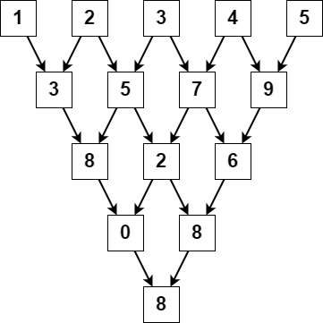

# [2221. Find Triangular Sum of an Array](https://leetcode.com/problems/find-triangular-sum-of-an-array/)

**Difficulty:** :yellow_circle: Medium

You are given a **0-indexed** integer array `nums`, where `nums[i]` is a digit between `0` and `9` (**inclusive**).

The triangular sum of `nums` is the value of the only element present in `nums` after the following process terminates:

Let `nums` comprise of `n` elements. If `n == 1`, **end** the process. Otherwise, **create** a new **0-indexed** integer array `newNums` of length `n - 1`.
For each index `i`, where `0 <= i < n - 1`, assign the value of `newNums[i] as (nums[i] + nums[i+1]) % 10`, where `%` denotes modulo operator.
**Replace** the array **nums** with **newNums**.
**Repeat** the entire process starting from step `1`.
Return the triangular sum of `nums`.

## Examples:

**Example 1:**


```text
Input: nums = [1,2,3,4,5]
Output: 8
Explanation:
The above diagram depicts the process from which we obtain the triangular sum of the array.
```

**Example 2:**

```text
Input: nums = [5]
Output: 5
Explanation:
Since there is only one element in nums, the triangular sum is the value of that element itself.
```


## Constraints:

- `1 <= nums.length <= 1000`
- `0 <= nums[i] <= 9`


## Solutions

### O(n^2) solution

#### Python3
```python3
class Solution:
    def triangularSum(self, nums: List[int]) -> int:
        while len(nums) != 1:
            for i in range(1, len(nums)):
                nums[i-1] = (nums[i-1]+nums[i])%10
            nums.pop()
        return nums[0]
```

The given solution solves the problem by performing the following steps:
1. Start a while loop that continues until the length of `nums` becomes 1.
2. Inside the loop, iterate over the range from 1 to the length of `nums`. In each iteration, calculate the value of `newNums[i-1]` as `(nums[i-1] + nums[i]) % 10`.
3. Replace `nums` with `newNums` by assigning `newNums` to `nums`.
4. After the loop ends, return the only element present in `nums`, which is the triangular sum.

#### Complexity Analysis

The time complexity of this algorithm is O(n^2), where n is the length of `nums`. This is because in each iteration of the while loop, we iterate over the range from 1 to the length of `nums`, resulting in a quadratic time complexity.

The space complexity of the algorithm is O(1) since it uses a constant amount of additional space.

#### Summary

The given solution calculates the triangular sum of the `nums` array by repeatedly performing the specified process until the length of `nums` becomes 1. It has a time complexity of O(n^2) and a space complexity of O(1), making it efficient for the given constraints.

***NB***: If you want to get community points please suggest solutions in other languages as merge requests.
