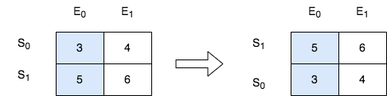

# [2545. Sort the Students by Their Kth Score](https://leetcode.com/problems/sort-the-students-by-their-kth-score/)

**Difficulty:** :yellow_circle: Medium

There is a class with `m` students and `n` exams. You are given a **0-indexed** `m x n` integer matrix `score`, where each row represents one student and `score[i][j]` denotes the score the `ith` student got in the `jth` exam. The matrix `score` contains **distinct** integers only.

You are also given an integer `k`. Sort the students (i.e., the rows of the matrix) by their scores in the `kth` (**0-indexed**) exam from the highest to the lowest.

Return *the matrix after sorting it.*

## Examples:

**Example 1:**


```
Input: score = [[10,6,9,1],[7,5,11,2],[4,8,3,15]], k = 2
Output: [[7,5,11,2],[10,6,9,1],[4,8,3,15]]
Explanation: In the above diagram, S denotes the student, while E denotes the exam.
- The student with index 1 scored 11 in exam 2, which is the highest score, so they got first place.
- The student with index 0 scored 9 in exam 2, which is the second highest score, so they got second place.
- The student with index 2 scored 3 in exam 2, which is the lowest score, so they got third place.

```

**Example 2:**



```
Input: score = [[3,4],[5,6]], k = 0
Output: [[5,6],[3,4]]
Explanation: In the above diagram, S denotes the student, while E denotes the exam.
- The student with index 1 scored 5 in exam 0, which is the highest score, so they got first place.
- The student with index 0 scored 3 in exam 0, which is the lowest score, so they got second place.

```

## Constraints:

- `m == score.length`
- `n == score[i].length`
- `1 <= m, n <= 250`
- `1 <= score[i][j] <= 105`
- `score` consists of **distinct** integers.
- `0 <= k < n`

## Solutions

### O(n\*log(n)) solution

The sortTheStudents method takes a `list` of lists called `score`, where each inner list represents the scores of a student. It also takes an integer `k` representing the index of the score to use for sorting.

1. The method `sortTheStudents` takes two parameters: `score`, which is a list of lists representing the scores of students, and `k`, which is an integer representing the index of the score to use for sorting.
2. The code uses the built-in `sorted` function to sort the `score` list based on a specific key. The `key` parameter is set to `lambda x: x[k]`, which means that it will use the value at index `k` of each sublist as the key for sorting.
3. The `reverse` parameter is set to `True`, indicating that the sorting should be done in descending order.
4. Finally, the sorted `score` list is returned as the output of the method.

**Complexity Analysis**

- Time Complexity: The time complexity of the code depends on the implementation of the `sorted` function, but it is typically O(n log n), where n is the number of elements in the `score` list. This is because the `sorted` function uses an efficient sorting algorithm called "TimSort" that has an average time complexity of O(n log n).
- Space Complexity: The space complexity is O(1) since the code does not use any extra space that scales with the input size. It only returns the sorted list without using additional data structures.

In summary, the code sorts the `score` list of students based on a specific score index `k` in descending order. The time complexity is typically O(n log n), and the space complexity is O(1).

#### Ptyhon3

```python3
class Solution:
    def sortTheStudents(self, score: List[List[int]], k: int) -> List[List[int]]:
        return sorted(score, key=lambda x: x[k], reverse=True)
```

#### TypeScript

```typescript
function sortTheStudents(score: number[][], k: number): number[][] {
  score.sort((a, b) => b[k] - a[k]);

  return score;
}
```

**_NB_**: If you want to get community points please suggest solutions in other languages as merge requests.
